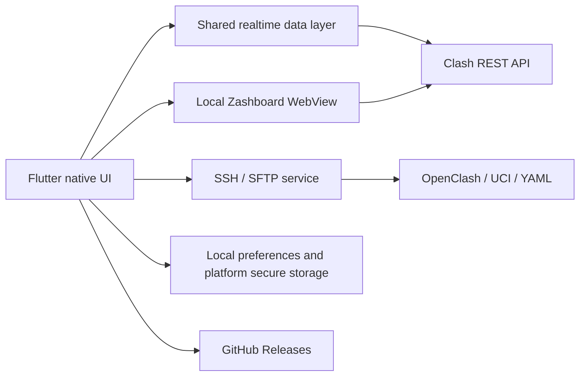

<div align="center">
  
  <h1>Proxly</h1>
  <p><strong>An Android and iOS monitoring and management client for user-operated OpenClash / Mihomo environments</strong></p>
  <p>Provides runtime status, proxy connections, and configuration management through the Clash API, bundled Zashboard, and SSH/SFTP.</p>

  [](https://github.com/CanMoqiu/proxly/releases/latest)
  [](#compatibility-and-limits)
  [](https://flutter.dev/)
  [](LICENSE)

  [GitHub Releases](https://github.com/CanMoqiu/proxly/releases) · **English** · [简体中文](README.md)
</div>

## Overview

Android and iOS share the `main` branch, Flutter 3.47.5 and a common version number. Manual GitHub Actions builds produce a signed Android Release APK and an unsigned Release IPA for self-signing on iOS 18+ iPhones. See the [shared build guide](docs/mobile-builds.zh-CN.md) and [iPhone installation guide](docs/ios-selfsign.zh-CN.md).

Proxly is a Flutter-based Android and iOS client that connects to an OpenClash / Mihomo controller deployed and administered by the user. It combines the Clash REST API, a bundled Zashboard web panel, and SSH/SFTP-based OpenClash configuration management.

Proxly does not contain the Clash or Mihomo proxy core and does not supply proxy nodes, subscriptions, network access, or traffic forwarding. The data displayed and actions executed by the app originate from the controller and OpenClash device configured by the user.

## Features

| Area | Function |
| --- | --- |
| Home dashboard | Reorder, show, and hide cards with a locally saved layout; retains the existing runtime overview structure |
| Runtime overview | Reads the core version, online state, live speeds, cumulative traffic, active connections, and proxy-provider traffic information |
| Proxy panel | Uses the bundled Zashboard to display proxy nodes, proxy groups, and rules, and synchronizes the web pages after app theme, language, or controller changes |
| Connections | Provides a native connection list and a mobile Zashboard view for connection metadata, proxy chains, and matched rules |
| Home quick settings | Exposes OpenClash run mode, proxy mode, region bypass, domain sniffing, DNS rule handling, and streaming auto-selection settings |
| Maintenance | Restarts OpenClash, flushes the Clash DNS cache, and closes all current proxy connections |
| YAML management | Switches the active configuration in a bottom sheet; selects, edits, uploads, renames, and exports YAML within the editor using the existing SSH/SFTP checks |
| Zashboard settings | Imports structurally validated and conflict-filtered Zashboard JSON settings, then reloads the active proxy, connection, and console WebViews |
| Updates | Checks application and Zashboard releases on GitHub; Android updates use APK assets; iOS opens GitHub Releases for manual installation; panel updates require a release archive with a SHA-256 digest |
| Interface | Supports Simplified Chinese, English, and system, light, or dark theme modes |

## Technical architecture



| Layer | Implementation |
| --- | --- |
| Native UI | Flutter Material components implement setup, home, native connections, settings, customizable dashboard cards, and YAML editor screens |
| Realtime data | `ClashDataHub` combines connection, traffic, and proxy-provider requests and shares short-lived state across native pages |
| Web panel | Zashboard static assets ship with the app and load from a local server; Proxy, Connections, and the standalone console own separate WebViews |
| Web synchronization | `WebPanelSync` synchronizes theme, language, controller settings, and imported Zashboard data, then broadcasts reloads to live WebViews |
| Controller transport | `ClashService` uses the Clash REST API for status, configuration, connection, DNS-cache, and connection-control operations |
| Device management | `dartssh2` provides SSH and SFTP; OpenClash quick settings write restricted UCI options, and YAML operations are confined to configuration directories |
| Local storage | `shared_preferences` stores interface and non-sensitive preferences; `flutter_secure_storage` stores the Clash secret, SSH password, and SSH host fingerprints |
| Updates | Application and Zashboard checks keep separate in-process state; downloaded files are checked for format, size, and digest before installation or activation |

## Compatibility and limits

| Item | Current implementation |
| --- | --- |
| Platform | Android and iOS 18+ iPhone; application ID / Bundle ID `top.canmoqiu.proxly` |
| Clash address | Accepts localhost, private or link-local IP addresses, `.local` / `.lan` domains, and local hostnames; the default controller port is `9090` |
| Clash API | The controller must expose `external-controller`; environments configured with a `secret` use the corresponding controller secret |
| SSH | OpenClash settings, YAML management, and restart operations use the `root` account on fixed port `22` |
| YAML directories | `/etc/openclash/config`, `/openclash/config`, `/etc/clash/config`, and `/root/.config/clash/config` |
| YAML files | Only `.yaml` and `.yml` files under a supported configuration directory are processed; each file is limited to `5 MB` |
| Zashboard JSON | Maximum `5 MB`, `2,000` top-level keys, and `1 MB` per serialized value |
| Zashboard ZIP | Maximum `50 MB` download, `2,000` entries, `20 MB` per file, `100 MB` extracted total, and `100:1` compression ratio |
| Restart impact | Applying OpenClash settings, changing the active YAML, and some configuration operations require an OpenClash restart and may interrupt existing proxy connections |

## Security mechanisms

- The Clash controller secret, SSH password, and trusted SSH host records use platform secure storage; iOS uses device-only Keychain items accessible while unlocked.
- A first SSH connection displays the host, port, algorithm, and SHA-256 fingerprint. A changed stored fingerprint requires another confirmation.
- Android cloud backup and device-transfer backup are disabled, so connection credentials are not migrated through app backup.
- Remote YAML paths are normalized and restricted to `.yaml` / `.yml` files under Clash / OpenClash `config` directories.
- Zashboard archives are checked for digest, entry count, file size, total extracted size, compression ratio, duplicate paths, symbolic links, and directory traversal before extraction.
- Zashboard JSON is subject to bounded reads, structural limits, and conflicting-key filtering before persistence. A failed validation does not replace the existing configuration.
- Application updates validate the APK response, file size, and basic APK structure. A SHA-256 digest is also verified when supplied by GitHub Releases.

## Repository layout

```text
lib/l10n/         Application language and interface translations
lib/pages/        Native pages, WebView containers, and interactions
lib/services/     Clash, SSH, OpenClash, update, and web-panel services
lib/widgets/      Shared interface components
assets/web_panel/ Bundled Zashboard static assets
assets/icons/     Application interface icons
android/          Android project configuration
ios/              iPhone project configuration
test/             Widget and service tests
```

## Core technologies and dependencies

| Project | Purpose | License |
| --- | --- | --- |
| [Flutter](https://flutter.dev/) | Shared mobile interface and application lifecycle | BSD-3-Clause |
| [Zashboard](https://github.com/Zephyruso/zashboard) | Clash web control panel | MIT |
| [flutter_inappwebview](https://github.com/pichillilorenzo/flutter_inappwebview) | Embedded web-panel rendering and JavaScript integration | Apache-2.0 |
| [dartssh2](https://github.com/TerminalStudio/dartssh2) | SSH, host-key verification, and SFTP | MIT |
| [Re-Editor](https://pub.dev/packages/re_editor) | YAML text editing and syntax highlighting | MIT |
| [flutter_secure_storage](https://pub.dev/packages/flutter_secure_storage) | Platform secure storage | BSD-3-Clause |
| [archive](https://pub.dev/packages/archive) | Zashboard release archive parsing and extraction | BSD-3-Clause |
| [http](https://pub.dev/packages/http) | Clash API and GitHub API requests | BSD-3-Clause |

See [pubspec.yaml](pubspec.yaml) for declared dependencies and versions.

## Legal and service boundaries

Proxly is an open-source Android and iOS client intended solely to manage OpenClash / Mihomo environments deployed by and accessible to the user. The maintainers do not provide proxy nodes, subscriptions, accounts, routes, bandwidth, VPNs, international network channels, traffic forwarding, hosted operation, remote configuration, or other ongoing software services. The maintainers do not participate in the construction, operation, or data transmission of a user's network environment.

This project is not intended to provide, facilitate, or assist services commonly described as bypassing network restrictions. It must not be used to break through, bypass, or evade network-access controls lawfully implemented by the People's Republic of China. Anyone using the project within the People's Republic of China must comply with applicable laws and regulations, use lawful network access and international networking channels, and must not use the project for unlicensed telecommunications activities, unlawful international networking, acts that endanger network security, infringement of lawful rights, or other unlawful activities.

Users independently decide whether to use the project and remain responsible for their devices, configurations, network access methods, data processing, conduct, and resulting consequences. The disclaimer in the [MIT License](LICENSE) continues to apply; this statement does not exclude liabilities that cannot lawfully be excluded.

Related official legal texts:

- [Interim Provisions of the People's Republic of China on the Administration of International Networking of Computer Information Networks](https://xzfg.moj.gov.cn/front/law/detail?LawID=1713&Query=), including Articles 6, 8, and 10 on international networking channels, operating activities, and access methods.
- [Telecommunications Regulations of the People's Republic of China](https://www.samr.gov.cn/zw/zfxxgk/fdzdgknr/bgt/art/2023/art_cb96d9e9147740f79f4c111bb637ce29.html), including provisions on telecommunications licensing, international communications, and network and information security.
- [Cybersecurity Law of the People's Republic of China](https://www.cac.gov.cn/2025-12/29/c_1768735112911946.htm), using the amended text effective January 1, 2026.

These links identify publicly available official legal texts and do not constitute legal advice for a specific use case.

## Affiliation and license

Proxly is an independent open-source project and has no official affiliation, authorization, or warranty relationship with Clash, OpenClash, Mihomo, Zashboard, or related service providers.

The source code is distributed under the [MIT License](LICENSE), Copyright (c) 2026 CanMoqiu.
