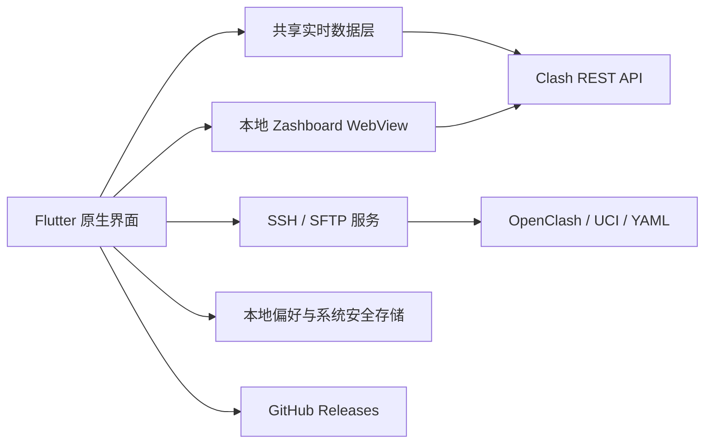

<div align="center">
  
  <h1>Proxly</h1>
  <p><strong>面向用户自有 OpenClash / Mihomo 环境的 Android / iOS 监控与管理客户端</strong></p>
  <p>通过 Clash API、内置 Zashboard 和 SSH/SFTP 提供运行状态、代理连接及配置管理功能。</p>

  [](https://github.com/CanMoqiu/proxly/releases/latest)
  [](#兼容条件与限制)
  [](https://flutter.dev/)
  [](LICENSE)

  [GitHub Releases](https://github.com/CanMoqiu/proxly/releases) · [English](README.en.md) · **简体中文**
</div>

## 项目概述

Android 与 iOS 在 `main` 主分支同步开发，共用 Flutter 3.47.5 和版本号。GitHub Actions 可手动同时构建正式签名 Android APK 与供 iOS 18+ iPhone 自签的 Release 未签名 IPA。详见 [双端构建说明](docs/mobile-builds.zh-CN.md) 和 [iPhone 自签使用说明](docs/ios-selfsign.zh-CN.md)。

Proxly 是使用 Flutter 开发的 Android / iOS 客户端，用于连接用户自行部署并有权访问的 OpenClash / Mihomo 控制器。应用整合 Clash REST API、内置 Zashboard Web 面板以及基于 SSH/SFTP 的 OpenClash 配置管理能力。

Proxly 不包含 Clash 或 Mihomo 代理内核，不提供代理节点、订阅、网络接入或流量转发能力。应用显示的数据和执行的操作均来自用户配置的控制器及 OpenClash 设备。

## 功能

| 模块 | 功能 |
| --- | --- |
| 首页 Dashboard | 卡片支持拖拽排序、显示/隐藏和本机布局保存；保留原有运行概览结构 |
| 运行概览 | 读取内核版本、在线状态、实时速率、累计流量、活动连接和代理提供商流量信息 |
| 代理面板 | 通过内置 Zashboard 查看代理节点、代理组和规则，并在应用主题、语言及控制器配置变化后同步 Web 页面 |
| 连接页面 | 提供原生连接列表和移动端 Zashboard 两种显示方式，可查看连接元数据、代理链路和命中规则 |
| 首页快捷设置 | 提供 OpenClash 运行模式、代理模式、区域绕过、域名嗅探、DNS 规则和流媒体自动选择等快捷配置 |
| 维护操作 | 支持重启 OpenClash、清理 Clash DNS 缓存和关闭当前全部代理连接 |
| YAML 管理 | 通过底部面板切换当前配置；编辑器内选择、编辑、上传、重命名和导出 `.yaml` / `.yml` 文件，沿用 SSH/SFTP 安全校验 |
| Zashboard 配置 | 导入经过结构验证和冲突过滤的 Zashboard JSON 设置，并刷新存活的代理、连接和控制台 WebView |
| 更新 | 从 GitHub Releases 检测应用和 Zashboard 版本；Android 下载 APK，iOS 跳转发布页手动安装；面板更新使用带 SHA-256 摘要的发布包 |
| 界面 | 支持简体中文、英语以及跟随系统、浅色、深色三种主题模式 |

首页布局和 YAML 操作详见 [Dashboard 使用说明](docs/dashboard.zh-CN.md)。

## 技术架构



| 层级 | 实现 |
| --- | --- |
| 原生界面 | Flutter Material 组件负责引导页、首页、原生连接列表、设置、自定义首页卡片和 YAML 编辑器 |
| 实时数据 | `ClashDataHub` 合并连接、流量和代理提供商请求，在多个原生页面之间共享短时缓存和状态 |
| Web 面板 | Zashboard 静态资源随应用发布并由本地服务器加载；代理页、连接页和独立控制台使用各自的 WebView 实例 |
| Web 同步 | `WebPanelSync` 同步主题、语言、控制器设置和导入后的 Zashboard 配置，并广播刷新存活的 WebView |
| 控制器通信 | `ClashService` 通过 Clash REST API 获取状态、配置和连接数据，并执行 DNS 缓存与连接操作 |
| 设备管理 | `dartssh2` 提供 SSH 和 SFTP；OpenClash 快捷设置通过受限选项写入 UCI，YAML 操作限制在配置目录内 |
| 本地存储 | `shared_preferences` 保存界面和非敏感偏好，`flutter_secure_storage` 保存 Clash 密钥、SSH 密码和 SSH 主机指纹 |
| 更新 | 应用与 Zashboard 分别维护进程内检测状态；下载文件在安装或切换前执行格式、大小及摘要检查 |

## 兼容条件与限制

| 项目 | 当前实现 |
| --- | --- |
| 平台 | Android 与 iOS 18+ iPhone；应用包名 / Bundle ID 为 `top.canmoqiu.proxly` |
| Clash 地址 | 接受本机地址、私有或链路本地 IP、`.local` / `.lan` 域名以及局域网主机名；默认控制器端口为 `9090` |
| Clash API | 控制器需要启用 `external-controller`；配置了 `secret` 时使用对应控制器密钥 |
| SSH | OpenClash 设置、YAML 管理和重启使用 `root` 账号及固定端口 `22` |
| YAML 目录 | `/etc/openclash/config`、`/openclash/config`、`/etc/clash/config`、`/root/.config/clash/config` |
| YAML 文件 | 仅处理配置目录下的 `.yaml` 和 `.yml` 文件；单个文件最大 `5 MB` |
| Zashboard JSON | 文件最大 `5 MB`，顶层键最多 `2000` 个，单个值序列化后最大 `1 MB` |
| Zashboard ZIP | 下载最大 `50 MB`、最多 `2000` 项、单文件最大 `20 MB`、解压总量最大 `100 MB`、压缩比最大 `100:1` |
| 重启影响 | OpenClash 设置批量应用、活动 YAML 切换和部分配置修改需要重启 OpenClash，现有代理连接可能中断 |

## 安全机制

- Clash 控制器密钥、SSH 密码及 SSH 主机信任记录通过系统安全存储保存；iOS 使用仅本机、解锁时可访问的 Keychain。
- SSH 首次连接会显示主机、端口、算法和 SHA-256 指纹；已保存的指纹发生变化时需要重新确认。
- Android 云备份和设备迁移备份处于关闭状态，连接凭据不会通过应用备份迁移到其他设备。
- YAML 远程路径经过规范化，并限制在 Clash / OpenClash 的 `config` 目录及 `.yaml` / `.yml` 文件范围内。
- Zashboard 更新包在解压前检查摘要、条目数量、文件大小、总解压量、压缩比、重复路径、符号链接和目录穿越。
- Zashboard JSON 在写入前执行有界读取、结构限制和冲突项过滤；验证失败时不替换现有配置。
- 应用更新检查 APK 响应、文件大小和 APK 基本结构；GitHub Release 提供 SHA-256 摘要时同时校验文件摘要。

## 仓库结构

```text
lib/l10n/         应用语言与界面翻译
lib/pages/        原生页面、WebView 容器与交互
lib/services/     Clash、SSH、OpenClash、更新和 Web 面板服务
lib/widgets/      共用界面组件
assets/web_panel/ 内置 Zashboard 静态资源
assets/icons/     应用界面图标资源
android/          Android 工程配置
ios/              iPhone 工程配置
test/             Widget 与服务测试
```

## 主要技术与依赖

| 项目 | 用途 | 协议 |
| --- | --- | --- |
| [Flutter](https://flutter.dev/) | 双端界面与应用生命周期 | BSD-3-Clause |
| [Zashboard](https://github.com/Zephyruso/zashboard) | Clash Web 控制面板 | MIT |
| [flutter_inappwebview](https://github.com/pichillilorenzo/flutter_inappwebview) | 内置 Web 面板渲染及 JavaScript 交互 | Apache-2.0 |
| [dartssh2](https://github.com/TerminalStudio/dartssh2) | SSH、主机密钥验证与 SFTP | MIT |
| [Re-Editor](https://pub.dev/packages/re_editor) | YAML 文本编辑和语法高亮 | MIT |
| [flutter_secure_storage](https://pub.dev/packages/flutter_secure_storage) | 系统安全存储 | BSD-3-Clause |
| [archive](https://pub.dev/packages/archive) | Zashboard 发布包解析与解压 | BSD-3-Clause |
| [http](https://pub.dev/packages/http) | Clash API 与 GitHub API 请求 | BSD-3-Clause |

依赖声明及具体版本以 [pubspec.yaml](pubspec.yaml) 为准。

## 法律与服务边界

Proxly 是公开源代码的 Android / iOS 客户端，仅用于管理用户自行部署并有权访问的 OpenClash / Mihomo 环境。项目维护者不提供代理节点、订阅、账号、线路、带宽、VPN、国际联网信道、流量转发、托管运行、远程代配置或其他持续性软件服务，也不参与用户网络环境的建设、运营或数据传输。

本项目不以提供、促成或协助所谓“翻墙”服务为目的，不得用于突破、绕过或规避中华人民共和国依法实施的网络访问管理措施。任何人在中华人民共和国境内使用本项目，均应遵守现行法律法规，通过合法的网络接入和国际联网信道使用网络，不得用于未经许可的电信业务、非法国际联网、危害网络安全、侵犯他人合法权益或其他违法活动。

用户自行决定是否使用本项目，并自行负责其设备、配置、网络接入方式、数据处理及由此产生的行为和后果。[MIT License](LICENSE) 中的免责声明继续适用；本声明不排除依法不能免除的责任。

相关官方法律文本：

- [《中华人民共和国计算机信息网络国际联网管理暂行规定》](https://xzfg.moj.gov.cn/front/law/detail?LawID=1713&Query=)，包括第六条、第八条和第十条有关国际联网信道、经营活动和接入方式的规定。
- [《中华人民共和国电信条例》](https://www.samr.gov.cn/zw/zfxxgk/fdzdgknr/bgt/art/2023/art_cb96d9e9147740f79f4c111bb637ce29.html)，包括电信业务许可、国际通信、网络与信息安全相关规定。
- [《中华人民共和国网络安全法》](https://www.cac.gov.cn/2025-12/29/c_1768735112911946.htm)，采用自 2026 年 1 月 1 日施行的修正文本。

上述链接用于指向公开的官方法律文本，不构成针对具体使用情形的法律意见。

## 关联关系与许可证

Proxly 是独立开源项目，与 Clash、OpenClash、Mihomo、Zashboard 及相关服务提供方不存在官方隶属、授权或担保关系。

项目源代码依据 [MIT License](LICENSE) 发布，Copyright (c) 2026 CanMoqiu。
